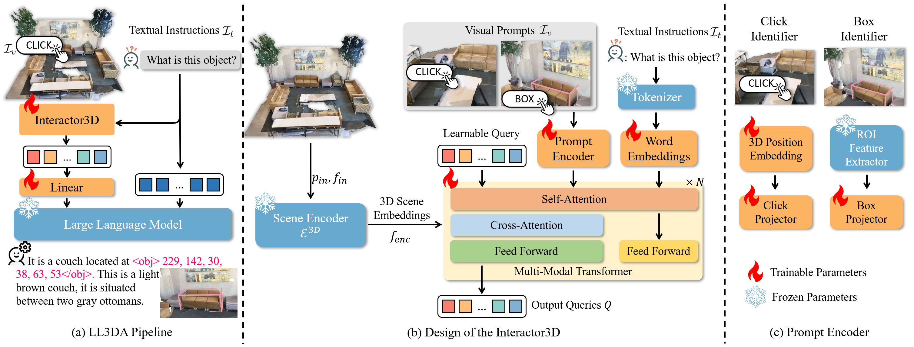

<div align= "center">
    <h1> Official repo for LL3DA </h1>

</div>

<div align="center">
    <h2> <a href="https://ll3da.github.io/">LL3DA: Visual Interactive Instruction Tuning for Omni-3D Understanding, Reasoning, and Planning</a></h2>

<p align="center">
  <a href="https://ll3da.github.io/">💻Project Page</a> •
  <a href="https://arxiv.org/abs/2311.18651">📄Arxiv Paper</a> •
  <a href="https://www.youtube.com/watch?v=224JzkdHjfg">🎞YouTube</a> •
  🤗HuggingFace Demo (WIP) •
  <a href="#-citation">Citation
</p>

</div>


## 🏃 Intro LL3DA

LL3DA is a Large Language 3D Assistant that could respond to both visual and textual interactions within **complex 3D environments**.
<!-- 
<details>
    <summary><b>Technical details</b></summary> -->

Recent advances in Large Multimodal Models (LMM) have made it possible for various applications in human-machine interactions. However, developing LMMs that can comprehend, reason, and plan in complex and diverse 3D environments remains a challenging topic, especially considering the demand for understanding permutation-invariant point cloud 3D representations of the 3D scene. Existing works seek help from multi-view images, and project 2D features to 3D space as 3D scene representations. This, however, leads to huge computational overhead and performance degradation. In this paper, we present LL3DA, a Large Language 3D Assistant that takes point cloud as direct input and respond to both textual-instructions and visual-prompts. This help LMMs better comprehend human interactions and further help to remove the ambiguities in cluttered 3D scenes. Experiments show that LL3DA achieves remarkable results, and surpasses various 3D vision-language models on both 3D Dense Captioning and 3D Question Answering.




## 🚩 News

- 2024-03-04. 💥 The code is fully released! Now you can train your customized models!
- 2024-02-27. 🎉 LL3DA is accepted by <font color="#dd0000">CVPR 2024</font>! See you in Seattle!
- 2023-11-30. 📣 Upload paper and init project

**TODO**:

- [x] Upload our paper to arXiv and build project pages.
- [x] Pray for acceptance.
- [x] Upload all the code and training scripts.
- [ ] Add support for training with larger LLM backends (~7B or above).
- [ ] Add local demo interface.
- [ ] Release pre-trained weights.
- [ ] Train on larger 3D VL benchmarks and scale up models.

## ⚡ Quick Start

<details>
  <summary><b>Environment Setup</b></summary>

**Step 1. Build Dependencies.** Our code is tested with CUDA 11.6 and Python 3.8.16. To run the codes, you should first install the following packages:

```
h5py
scipy
cython
plyfile
'trimesh>=2.35.39,<2.35.40'
'networkx>=2.2,<2.3'
'torch=1.13.1+cu116'
'transformers>=4.37.0'
```

After that, build the `pointnet2` and accelerated `giou` from source:

```{bash}
cd third_party/pointnet2
python setup.py install
```

```{bash}
cd utils
python cython_compile.py build_ext --inplace
```

**Step 2. Download pre-trained embeddings.** Download the pre-processed BERT embedding weights from [huggingface](https://huggingface.co/CH3COOK/bert-base-embedding/tree/main) and store them under the [`./bert-base-embedding`](./bert-base-embedding) folder. The weights are **the same** from the official BERT model, we just modified the names of certain parameters.

</details>


<details>
  <summary><b>Data Preparation</b></summary>

Our repo requires the 3D data from ScanNet, the natural language annotations, and the pre-trained LLM weights.

**Step 1. Download and Prepare the ScanNet 3D Data.**

**<font color="#dd0000">Updates 2024-07-01:</font>** You can download the pre-processed data from [here](https://huggingface.co/CH3COOK/LL3DA-weight-release/blob/main/scannet_data.zip).


1. Follow the instructions [here](https://github.com/ch3cook-fdu/Vote2Cap-DETR/tree/master/data/scannet) and download the ScanNetV2 dataset. 
2. Change the `SCANNET_DIR` to the scans folder in [`data/scannet/batch_load_scannet_data.py`](https://github.com/ch3cook-fdu/Vote2Cap-DETR/blob/master/data/scannet/batch_load_scannet_data.py#L16), and run the following commands.
```{bash}
cd data/scannet/
python batch_load_scannet_data.py
```

**Step 2. Prepare Language Annotations**

To train the model, you are required to prepare language annotations from `ScanRefer`, `Nr3D`, `ScanQA`, and the ScanNet part of `3D-LLM`.

1. `ScanRefer`. Follow the commands [here](https://github.com/daveredrum/ScanRefer) to download the `ScanRefer` dataset.
2. `Nr3D`. Follow the commands [here](https://referit3d.github.io/#dataset) to download the `Nr3D` dataset, and [pre-process](https://github.com/ch3cook-fdu/Vote2Cap-DETR/blob/master/data/parse_nr3d.py) it.
3. `ScanQA`. Follow the commands [here](https://github.com/ATR-DBI/ScanQA/blob/main/docs/dataset.md) to download the `ScanQA` dataset.
4. `3D-LLM`. The data are located at [here](./data/3D_LLM). We have also shared our pre-processing scripts [here](./data/3D_LLM/pre-process-3D-LLM.py).

We will update the latest released data (V3) from 3D-LLM.


Finally, organize the files into the following folders:

```
./data/
  ScanRefer/
    ScanRefer_filtered_train.json
    ScanRefer_filtered_train.txt
    ScanRefer_filtered_val.json
    ScanRefer_filtered_val.txt

  Nr3D/
    nr3d_train.json
    nr3d_train.txt
    nr3d_val.json
    nr3d_val.txt

  ScanQA/
    ScanQA_v1.0_test_w_obj.json
    ScanQA_v1.0_test_wo_obj.json
    ScanQA_v1.0_train.json
    ScanQA_v1.0_val.json

  3D_LLM/
    3d_llm_embodied_dialogue_filtered_train.json
    3d_llm_embodied_dialogue_filtered_val.json
    3d_llm_embodied_planning_filtered_train.json
    3d_llm_embodied_planning_filtered_val.json
    3d_llm_scene_description_train.json
    3d_llm_scene_description_val.json
```

**Step 3. \[Optional\] Download Pre-trained LLM weights.** If your server has no trouble auto-downloading weights from huggingface🤗, feel free to skip this step.

Download files from the `opt-1.3b` checkpoint (or any other decoder-only LLM) at [huggingface](https://huggingface.co/facebook/opt-1.3b/tree/main), and store them under the `./facebook/opt-1.3b` directory. Make sure the required files are downloaded:
```
./facebook/opt-1.3b/
  config.json
  merges.txt
  pytorch_model.bin
  special_tokens_map.json
  tokenizer_config.json
  vocab.json
```


</details>


## 💻 Train your own models

**<font color="#dd0000">Updates 2024-07-01:</font>** The released version is slightly different from our paper implementation. In our released version, we *standardized the data format* and *dropped duplicated text annotations*. To reproduce our reported results, please use the scripts provided in `scripts-v0` to produce the generalist weights.

```
bash scripts-v0/opt-1.3b/train.generalist.sh
```

Our code should support **any decoder-only LLMs** (`facebook/opt-1.3b`, `gpt2-xl`, `meta-llama/Llama-2-7b` or even the **<font color="#dd0000">LATEST</font>** `Qwen/Qwen1.5-1.8B` and `Qwen/Qwen1.5-4B`). Check out the following table for recommended LLMs in different scales! **By default, the models are trained with eight GPUs.**

|            <1B            |           1B-4B           |                ~7B               |
|:-------------------------:|:-------------------------:|:--------------------------------:|
|        `gpt2`(124m)       |   `TinyLlama-1.1B`(1.1b)  |     `facebook/opt-6.7b`(6.7b)    |
| `facebook/opt-125m`(125m) | `facebook/opt-1.3b`(1.3b) | `meta-llama/Llama-2-7b-hf`(6.7b) |
|    `gpt2-medium`(355m)    |      `gpt2-xl`(1.6b)      |      `Qwen/Qwen1.5-7B`(7.7b)     |
| `Qwen/Qwen1.5-0.5B`(620m) | `Qwen/Qwen1.5-1.8B`(1.8b) |                 -                |
|     `gpt2-large`(774m)    | `facebook/opt-2.7b`(2.7b) |                 -                |
|             -             |  `microsoft/phi-2`(2.8b)  |                 -                |
|             -             |  `Qwen/Qwen1.5-4B`(3.9b)  |                 -                |

We provide training scripts in the `scripts` folder with different LLM backends. Feel free to modify the hyper parameters in those commands.

For other LLM backends, please modify the commands manually by changing `--vocab` to other LLMs.


<details>
  <summary><b>Training</b></summary>

  To train the model as a 3D generalist:

  ```{bash}
  bash scripts/opt-1.3b/train.generalist.sh
  ```

  After the model is trained, you can tune the model on ScanQA for 3D Question Answering:

  ```{bash}
  bash scripts/opt-1.3b/tuning.scanqa.sh
  ```

  And, on ScanRefer / Nr3D for 3D Dense Captioning:

  ```{bash}
  bash scripts/opt-1.3b/tuning.scanrefer.sh
  bash scripts/opt-1.3b/tuning.nr3d.sh
  ```

  You can also tune the model to predict bounding boxes for open vocabulary object detection!

  ```{bash}
  bash scripts/opt-1.3b/tuning.ovdet.sh
  ```

</details>

<details>
  <summary><b>Evaluation</b></summary>

  To evaluate the model as a 3D generalist:

  ```{bash}
  bash scripts/opt-1.3b/eval.generalist.sh
  ```

  On ScanQA for 3D Question Answering:

  ```{bash}
  bash scripts/opt-1.3b/eval.scanqa.sh
  ```

  And, on ScanRefer / Nr3D for 3D Dense Captioning:

  ```{bash}
  bash scripts/opt-1.3b/eval.scanrefer.sh
  bash scripts/opt-1.3b/eval.nr3d.sh
  ```

</details>


## 📖 Citation

If you find our code or paper helpful, please consider starring ⭐ us and citing:

```{bibtex}
@misc{chen2023ll3da,
    title={LL3DA: Visual Interactive Instruction Tuning for Omni-3D Understanding, Reasoning, and Planning}, 
    author={Sijin Chen and Xin Chen and Chi Zhang and Mingsheng Li and Gang Yu and Hao Fei and Hongyuan Zhu and Jiayuan Fan and Tao Chen},
    year={2023},
    eprint={2311.18651},
    archivePrefix={arXiv},
    primaryClass={cs.CV}
}
```

## Acknowledgments

Thanks to [Vote2Cap-DETR](https://github.com/ch3cook-fdu/Vote2Cap-DETR), [3D-LLM](https://github.com/UMass-Foundation-Model/3D-LLM), [Scan2Cap](https://github.com/daveredrum/Scan2Cap), and [3DETR](https://github.com/facebookresearch/3detr). We borrow some of their codes and data.


## License

This code is distributed under an [MIT LICENSE](LICENSE). If there are any problem regarding our paper and code, feel free to open an issue!
